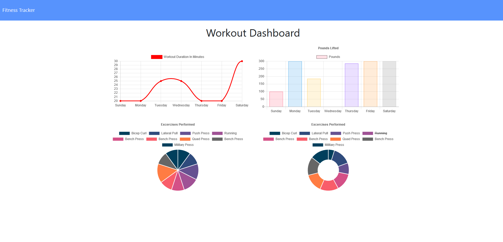

# Workout Tracker
 
  
 
 
  

A full-stack fitness tracker app built on NodeJS using ExpressJS, MongoDB, and Mongoose.  
See your cumulative exercise statistics plotted and graphed by type and day!   

---

## Table of Contents

* [Installation](#Installation)  
* [Contribution](#Contribution)  
* [User Story](#User-Story)  
* [Link to Deployed Application](#Link-to-Deployed-Application)  
* [Example](#Example)  
* [Contents](#Contents)  
* [Team](#Author)  
* [License](#License)  
* [Credits](#Credits)  
  
 ---
 
 
## Installation

Feel free to [clone the repo](https://github.com/abraspin/workout-tracker) and run locally by using the terminal/bash command `node server` or `npm run start`

## Contribution

Please contact me if you find an issue or have a suggestion for future development!
 
## User Story

>As a user, I want to be able to view, create, and track daily workouts.  
>I want to be able to log multiple exercises in a workout on a given day.  
>I should also be able to track the name, type, weight, sets, reps, and duration of exercise.   
>If the exercise is a cardio exercise, I should be able to track my distance traveled.  

---

## Link to Deployed Application

Just visit  to begin!  

Start a new workout or add exercises to an existing one. Check out the Dashboard to see your cumulative stats!

---

## Example

---

## Author
[Abraham Spindel](https://github.com/abraspin)

---

## License

---

## Credits
* NodeJS Project [MIT license](https://raw.githubusercontent.com/nodejs/node/master/LICENSE)   
* Express Morgan [MIT license](https://github.com/expressjs/morgan/blob/master/LICENSE)
* ChartJS [MIT license](https://github.com/chartjs/Chart.js/blob/master/LICENSE.md)
* MongoDB [SSPL](https://www.mongodb.com/licensing/server-side-public-license)
* MongoDB Mongoose [MIT license](https://github.com/Automattic/mongoose/blob/master/LICENSE.md)
* ExpressJS [MIT license](https://github.com/expressjs/express/blob/HEAD/LICENSE)   
* Node Package Manager (npm) [Artistic License 2.0](https://www.npmjs.com/policies/npm-license)  

